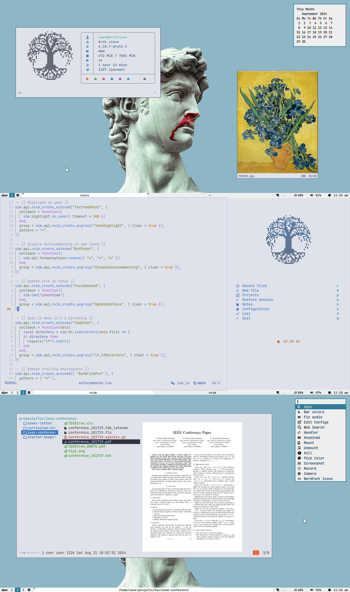

<h1 align="center"> DotFiles</h1>

Here are some details about this setup

- **OS** = Arch Linux
- **Login Manager** = None
- **WM** = [dwm](https://github.com/mintycube/dwm)
- **Bar** = [dwmblocks](https://github.com/mintycube/dwmblocks)
- **Compositor** = [picom-pijulius](https://github.com/pijulius/picom/tree/implement-window-animations)
- **LockScreen** = [slock](https://github.com/mintycube/slock)
- **Resolution** = 1366x768
- **Cursor-theme** = [Phinger Cursors Light](https://github.com/phisch/phinger-cursors)
- **Gtk theme** = Adwaita
- **Shell** = [zsh](https://wiki.archlinux.org/index.php/Zsh) + [zsh4humans](https://github.com/romkatv/zsh4humans)
- **Terminal** = [st](https://github.com/mintycube/st)
- **Font** = JetBrainsMono Nerd Font
- **Editor** = [Neovim](https://github.com/mintycube/nvim-config)
- **File Manager** = [lf](https://github.com/gokcehan/lf) + [ctpv](https://github.com/NikitaIvanovV/ctpv)
- **Browser** = Firefox + [Betterfox](https://github.com/yokoffing/Betterfox)
- **Menu** = [dmenu](https://github.com/mintycube/dmenu)
- **Image-viewer** = [nsxiv](https=//github.com/nsxiv/nsxiv)
- **Music-player** = [cmus](https://cmus.github.io/)
- **Video-player** = [mpv](https://mpv.io/) + [uosc](https://github.com/tomasklaen/uosc) + [thumbfast](https://github.com/po5/thumbfast)
- **Pdf-viewer** = [zathura](https=//github.com/pwmt/zathura)
- **Calculator** = [qalculate-gtk](https=//github.com/Qalculate/qalculate-gtk)
- **Networkmanager** = [dmenu](https=//github.com/firecat53/networkmanager-dmenu)
- **Notification Client** = [dunst](https=//github.com/dunst-project/dunst)
