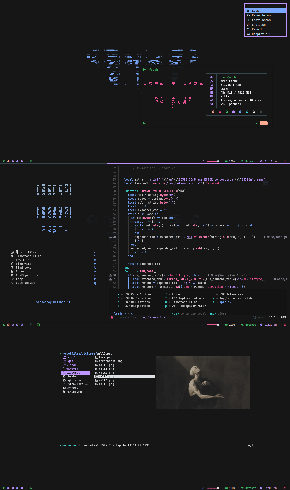

<h1 align="center"> DotFiles</h1>

These dotfiles are meant to be used after installing [LARBS](https://github.com/LukeSmithxyz/LARBS).
Here are some details about my setup:

- **OS**: Arch Linux
- **Login Manager**: None
- **WM**: [bspwm](https://github.com/baskerville/bspwm)
- **Bar**: [polybar](https://github.com/polybar/polybar)
- **Hotkey Daemon**: [sxhkd](https://github.com/baskerville/sxhkd)
- **Compositor**: [picom-allusive](https://aur.archlinux.org/packages/picom-allusive)
- **Gtk-theme** = [siduck-onedark](https://github.com/siduck/dotfiles/tree/master/gtk/siduck-onedark)
- **Cursor-theme** = [Bibata-Modern-Ice](https://github.com/ful1e5/Bibata_Cursor)
- **Shell**: [zsh](https://wiki.archlinux.org/index.php/Zsh) + [zsh4humans](https://github.com/romkatv/zsh4humans)
- **Terminal**: [kitty](https://github.com/kovidgoyal/kitty/) + [st](https://github.com/mintycube/st)
- **Font**: JetBrainsMono Nerd Font
- **Scratchpads**: [tdrop](https://github.com/noctuid/tdrop)
- **Editor**: [Neovim](https://github.com/neovim/neovim/)
- **File Manager**: [lf](https://github.com/gokcehan/lf) + [cptv](https://github.com/NikitaIvanovV/ctpv)
- **Browser**: Firefox
- **Menu**: [dmenu-flexipatch](https://github.com/mintycube/dmenu-flexipatch)
- **Image-viewer** = [nsxiv](https://github.com/nsxiv/nsxiv)
- **Music-player** = [mpd](https://github.com/MusicPlayerDaemon/MPD) + [ncmpcpp](https://github.com/ncmpcpp/ncmpcpp)
- **Pdf-viewer** = [zathura](https://github.com/pwmt/zathura)
- **Calculator** = [qalculate-gtk](https://github.com/Qalculate/qalculate-gtk)
- **Networkmanager** = [dmenu](https://github.com/firecat53/networkmanager-dmenu)
- **Notification Client** = [dunst](https://github.com/dunst-project/dunst)
