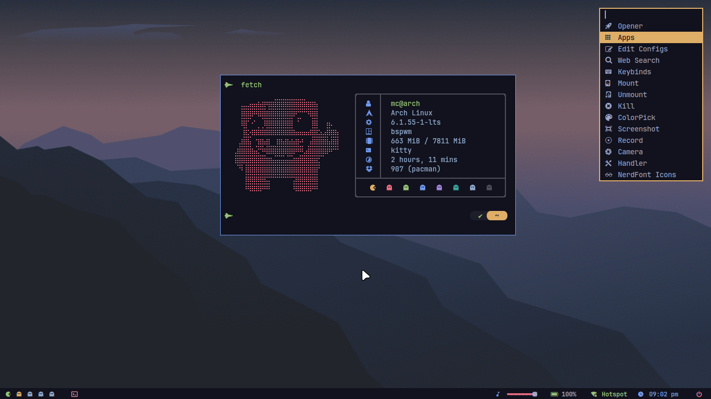

<h1 align="center"> DotFiles</h1>

These dotfiles are meant to be used  after installing [LARBS](https://github.com/LukeSmithxyz/LARBS).
Here are some details about my setup:

+ **OS**: Arch Linux
+ **WM**: [bspwm](https://github.com/baskerville/bspwm)
+ **Bar**: [polybar](https://github.com/polybar/polybar)
+ **Shell**: [zsh](https://wiki.archlinux.org/index.php/Zsh) + [zsh4humans](https://github.com/romkatv/zsh4humans)
+ **Terminal**: [kitty](https://github.com/kovidgoyal/kitty/) + [st](https://github.com/mintycube/st)
+ **Editor**: [Neovim](https://github.com/neovim/neovim/) + [NvChad](https://github.com/NvChad/NvChad) + custom config
+ **File Manager**: [lf](https://github.com/gokcehan/lf)
+ **Launcher**: [dmenu-flexipatch](https://github.com/mintycube/dmenu-flexipatch)
+ **Browser**: Firefox
